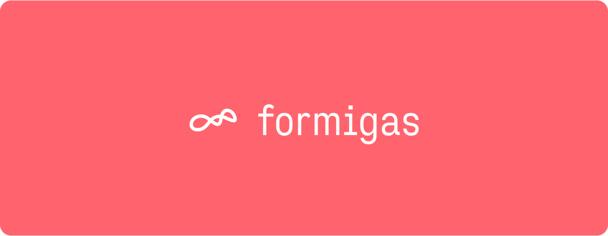

<p align="center">

</p>

# Framework bricks

There are currently two bricks in this repository:

- [core][core_repo_link]: core flutter app inspired by [very_good_ventures][very_good_ventures_link]
- [feature][feature_repo_link]: a brick that provides the files and structure for a feature how we
  implement it at [formigas][formigas_link]

## Contains

### Translations

The project template contains a translations mechanism that is based on
the [flutter_localizations](https://api.flutter.dev/flutter/flutter_localizations/flutter_localizations-library.html) package. The translations are stored in the `lib/common/l10n` folder. The translations are loaded in the `main.dart` file and are available in the whole app.

### Theme

The project template contains a theme configuration files in `lib/common/` folder. We separated
theme to `color_scheme.dart` and `custom_themes.dart` files where you add your color or whole widget
theme configuration. The theme is loaded in the `main.dart` file and is available in the whole app.

### Routing

The project template is using [go_router](https://pub.dev/packages/go_router) for the routing. The routes are defined in
the `app/router` file and loaded in the `main.dart` file.

### State management

The project template is using [formigas_mvc] for the state management. This is a
custom state management solution that is using the MVC pattern. You can find more information in the
[formigas_mvc](formigas_mvc_link) repository.

## Usage

### Preparation

If not done, add the formigas_core brick to your local mason:

```sh
mason init
mason add formigas_core --git-url git@git.dev.formigas.de:framework/bricks.git --git-path core --git-ref develop
```

The formigas_core brick should show up in the list of mason bricks:

```
$ mason list
/Users/User/foo/bar
└── formigas_core 0.1.0 -> git@git.dev.formigas.de:framework/bricks.git#{commit-hash}
```

### Core

Create a new formigas core application

```sh
mason make formigas_core
```

### Feature

Together with [formigas_mvc](formigas_mvc_link) we have a feature brick that provides the files and MVC structure the app.
To add a new feature to your app run the following command in the root of your project:

```sh
mason make formigas_feature
```

## Helpful links

- [VGV Core Brick][very_good_ventures_link]
- [Brick Hub Development][brick_hub_development_link]
- [Mason][mason_link]

[very_good_ventures_link]: https://github.com/VeryGoodOpenSource/very_good_core

[formigas_link]: https://formigas.io

[brick_hub_development_link]: https://docs.brickhub.dev/brick-development

[mason_link]: https://github.com/felangel/mason

[core_repo_link]: ./core/README.md

[feature_repo_link]: ./feature/README.md
